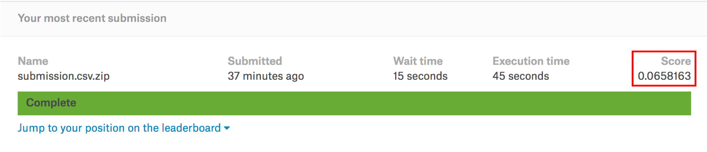

# Kaggle-Competitions
### 1. Zillow Prize: Zillow’s Home Value Prediction (Zestimate)
Can you improve the algorithm that changed the world of real estate? 
 

**\- *Result***

- Public LB 
    - Score : 0.0658163
    - Rank  : 3380 / 3779
    
- Private LB 
    - Score : 0.0760755
    - Rank  : 2688 / 3779

\*source : [zillow-prize-1](https://www.kaggle.com/c/zillow-prize-1)

---

### 2. House Prices: Advanced Regression Techniques
Predict sales prices and practice feature engineering, RFs, and gradient boosting

\*source : [house-prices-advanced-regression-techniques](https://www.kaggle.com/c/house-prices-advanced-regression-techniques)

---

### 3. Avito Demand Prediction Challenge
Predict demand for an online classified ad

\*source: [avito-demand-prediction](https://www.kaggle.com/c/avito-demand-prediction)

